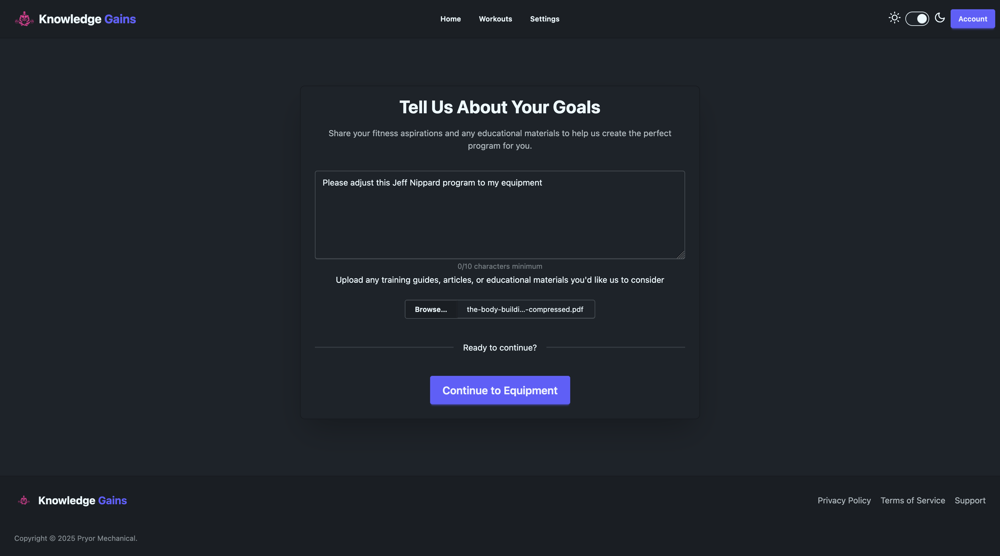
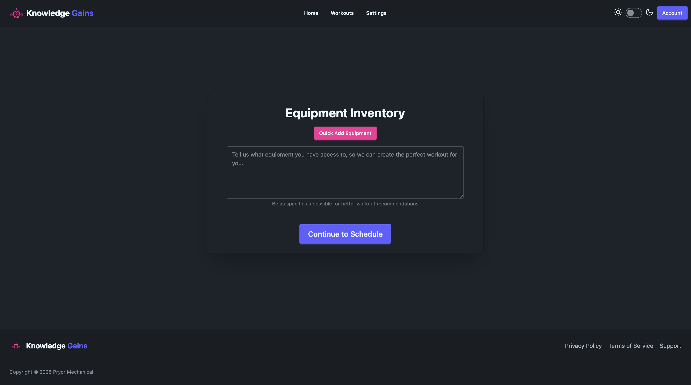

# Knowledge Gains - Science-Based Hypertrophy Program Generator

A modern web application that generates personalized weightlifting programs using OpenAI's GPT-4 and scientific training
principles. Upload your training logs, specify your equipment, and get AI-generated programs tailored to your goals.

## Features

### AI-Powered Program Generation

- **OpenAI GPT-4.1 Integration**: Uses advanced language models for intelligent program design
- **Science-Based**: Built on resistance training research principles
- **File Upload Support**: Upload previous training logs, PDF research papers, or popular program books (PDF, TXT) for
  program continuity
- **Equipment Adaptation**: Programs automatically adjust to your available equipment

### Personalized Training Experience

- **Interactive Setup Wizard**: 3-step process

#### Capture Goals



#### Specify Equipment


!(app/static/assets/equip-inventory-add.png)

#### Schedule Preferences

!(app/static/assets/schedule-preferences.png)

#### Workout Summary and Tracking

!(app/static/assets/program-description.png)
!(app/static/assets/program-day-overview.png)

### Modern User Interface

- **Real-time Updates**: HTMX
- **Responsive Design**: Tailwind CSS and DaisyUI components
- **Template Engine**: jinja2
- **Interactive Elements**: Alpine.js

## Quick Start

### Prerequisites

- Python 3.13 or higher
- OpenAI API account
- Supabase account (for database and authentication*)

  _*Authentication and JSON editor coming soon_

### Installation

1. **Clone the repository**
   ```bash
   git clone https://github.com/your-username/knowledge-gains-ai.git
   cd knowledge-gains-ai
   ```

2. **Install dependencies using uv (recommended)**
   ```bash
   # Install uv if you haven't already
   curl -LsSf https://astral.sh/uv/install.sh | sh
   
   # Install project dependencies
   uv sync
   ```

   **Or using pip**
   ```bash
   pip install -e .
   ```

3. **Set up environment variables**
   ```bash
   cp .env.example .env
   ```

   Edit `.env` with your API keys:
   ```env
   OPENAI_API_KEY=sk-your-openai-api-key-here
   SUPABASE_URL=https://your-project.supabase.co
   SUPABASE_SERVICE_ROLE_KEY=your-supabase-service-role-key
   SESSION_SECRET=your-32-character-session-secret
   ```

4. **Set up Supabase database**

   Create the following tables in your Supabase project:

```sql
   -- Core tables
create table wizard_answers
(
    id         uuid primary key,
    user_id    uuid  not null,
    answers    jsonb not null,
    created_at timestamptz default now()
);

create table routines
(
    id           uuid primary key,
    user_id      uuid  not null,
    title        text  not null,
    routine_json jsonb not null,
    created_at   timestamptz default now()
);

create table progress_logs
(
    id            uuid primary key,
    user_id       uuid  not null,
    routine_id    uuid  not null,
    week          int   not null,
    day           int   not null,
    exercise_name text  not null,
    set_number    int   not null,
    weight        float not null,
    reps          int   not null,
    ts            timestamptz default now()
);

-- New tables for enhanced features
create table file_vectors
(
    id        uuid primary key,
    user_id   uuid not null,
    filename  text not null,
    file_text text not null,
    embedding vector(1536),
    ts        timestamptz default now()
);

create table completed_days
(
    id         uuid primary key,
    user_id    uuid not null,
    routine_id uuid not null,
    week       int  not null,
    day        int  not null,
    ts         timestamptz default now()
);
```

5. **Run the application**
   ```bash
   # Using uv
   uv run uvicorn app.main:app --reload --host 0.0.0.0 --port 8000
   
   # Or directly with uvicorn
   uvicorn app.main:app --reload --host 0.0.0.0 --port 8000
   ```

6. **Access the application**

   Open your browser and navigate to `http://localhost:8000`

## Configuration

### Required API Keys

#### OpenAI API Key

1. Visit [OpenAI Platform](https://platform.openai.com/)
2. Create an account or sign in
3. Generate an API key from the API keys section
4. Add credits to your account for API usage

#### Supabase Configuration

1. Create a new project at [Supabase](https://supabase.com/)
2. Go to Settings → API to find your:
    - Project URL (`SUPABASE_URL`)
    - Service role key (`SUPABASE_SERVICE_ROLE_KEY`)
3. Enable the `vector` extension in SQL Editor:
   ```sql
   create extension if not exists vector;
   ```

#### Session Secret

Generate a secure 32-character string for session encryption:

```bash
python -c "import secrets; print(secrets.token_urlsafe(32))"
```

## How It Works

### 1. Program Generation Process

- Users complete a 3-step wizard (goals, equipment, schedule)
- Optional file upload provides training history context
- OpenAI GPT-4o analyzes inputs using scientific training principles
- AI generates structured JSON programs validated by Pydantic schemas

### 2. File Processing & Vector Storage

- Uploaded training logs are processed and embedded using OpenAI's text-embedding-3-small
- File content is stored with vector embeddings in Supabase for future reference
- AI prioritizes uploaded file data when generating programs

### 3. Workout Tracking

- Log individual sets with weight and rep counts
- Automatic progression tracking and day completion detection
- Smart navigation to next scheduled workout sessions

## Development

### Development Setup

```bash
# Install with development dependencies
uv sync --group dev

# Run tests
uv run pytest

# Type checking
uv run ruff 
```
